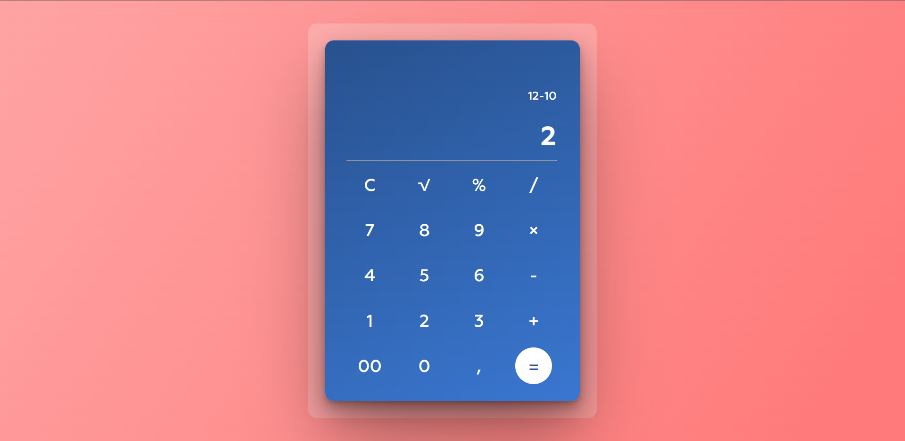

# Calculator Application

## Description:

This app is a simple calculator made with pure TypeScript.
 
This project was bootstrapped with [Create React App](https://github.com/facebook/create-react-app).

---

## Screenshot:

---

## App Installation:

Clone repository and then install it by writing `npm install` in the command line

---

## App Usage:

Run the project write `npm start` in the command line and then open http://localhost:3000 at your browser

To run tests write `npm test` in the command line 
